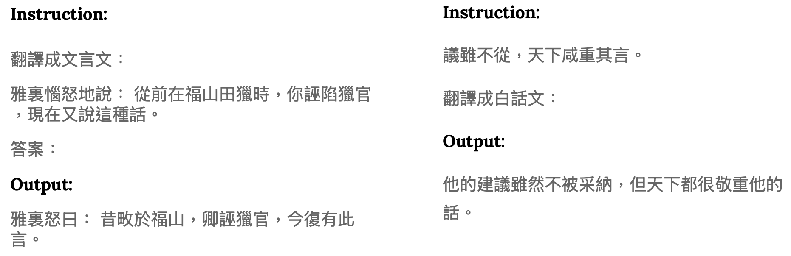

# classical-chinese-instruction-tuning-qlora
### Task Description - Classical Chinese Instruction Tuning with QLoRA
This work applies instruction tuning with **QLoRA** to train **Gemma2** capable of translating between Classical Chinese (文言文) and Modern Chinese (白話文).

## Performance
Evaluation metrics: **Perplexity (PPL)**
|               | Baseline   | Result   |
|---------------|------------|----------|
| Public Score  | 17.5       | **15.3** |
| Private Score | 24.0       | **19.9** |

The **PPL** was calculated using `ppl.py`:
```
python ppl.py \
--base_model_path /path/to/zake7749--gemma-2-2b-it-chinese-kyara-dpo \
--peft_path /path/to/adapter_checkpoint \
--test_data_path /path/to/test/data \
```
## Data
Data can be downloaded on [Google Drive](https://www.kaggle.com/t/d8fef9a83a014314be430117cfe5557e).
* Training (train.json): 10000
* Testing (Public) (public_test.json): 250
* Testing (Private) (private_test.json): 250
## Adapter_model Weights
[zake7749/gemma-2-2b-it-chinese-kyara-dpo](https://huggingface.co/zake7749/gemma-2-2b-it-chinese-kyara-dpo) is fine-tuned on traditional chinese data.  
QLoRA reduces the memory usage of LLM fine-tuning by employing 4-bit quantization to compress a LLM, while utilizing 16-bit float to perform computations.  
The fine-tuned adapter_model weights are available via [Google Drive](https://drive.google.com/file/d/1SS1qIQpxpsbmCV7ievY9AlZx2K9-g_eU/view?usp=share_link).
## Training
```
# Run training
python train.py \
--train_file '/path/to/train.json' \
--model_name_or_path 'path/to/zake7749--gemma-2-2b-it-chinese-kyara-dpo' \
--output_dir '/path/to/save/adapter_ckeckpoint' \
```
## Testing
```
# Run testing
python inference.py \
--model_name_or_path '/path/to/zake7749--gemma-2-2b-it-chinese-kyara-dpo' \
--adapter_name_or_path '/path/to/adapter_ckeckpoint' \
--test_file '/path/to/private_test.json' \
--output_file '/path/to/prediction.json' \
```